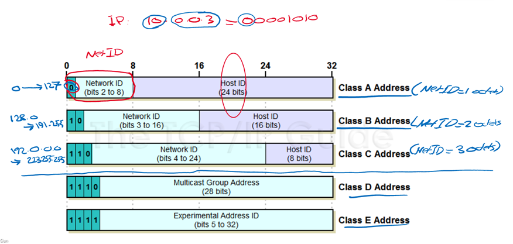

# First recording (07/06/2021)
## What is a network
- A collection of devices that are connected to each-other
- Main idea is to be able to exchange data
Main Network components are the host/end device

Any device connected to the network that exchanges data is a host/ end device

Devices on the network that are assigned an address for communication purposes

Servers are a software providing a service to other devices on the network

Client is a device that requests for a service

Server client architecture, one requests (client), one provides (server)

Peer to peer, both can ask for services from each other
- Printer and pc is a peer to peer architecture

Intermediary devices connect the end devices to the network (wireless router, router, LAN switch, multilayer switch, Firewall Appliance)

In the network to connect the end devices or to provide a function to the end devices

Network media:
-	Metal wires (cable)
-	Fibre optics
-	Wireless (any)

Main four categories (host, server/client, intermediary devices, network media)

Network types:
-	Size of the area covered
-	Number of users connected
-	Type of services (provided by the network)
-	Area of responsibility ((LAN, your responsibility) (WAN, not your responsibility))
Most common networks 
-	LAN (local area network)
o	Network in a small geographical area (house)
-	WAN (wide area network)
o	Network infrastructure that provides network connection over a large geographical location (internet (collection of WANs))
-	MAN (metro area network (basically a WAN))

Internet: (interconnected network (public)(worldwide)) 

red line is WAN
    
blue is LAN 

intranet (private connection (company only))

- refers to a private connection of LANs and WANs in a company

extranet (not really used, not well defined (suppliers, customers collaborators))
- secure and safe access between different orgs

communication fundamentals:

formed of three elements
-	Message source (sender)
-	Message destination (receiver)
-	Channel 

Goal = to transmit a message over the channel

Transmit the source message to the destination message over the channel

Message delivery options
-	Unicast (send message to one destination)
-	Multicast (multiple destinations)
-	Broadcast (all destinations)

# Second recording (07/06/2021)
Protocol suite/standards

A group of inter-related protocols, each one performs a specific task

Iso TCIP

Developed by ISO and ITU

OSI is a standard (the concept)

(picture is osi model layer (open systems interconnection))

Physical = physical attributes of the connection, uses network media, can find out network speeds here

Data link = layer that takes care of the protocols, describes methods of exchanging data between the protocols, where you define the network and physical addressing

Network = addressing and routing are the main functionalities of this layer, provides services to exchange data across networks Ips are on this layer, to give an address to the host, or any device on the network. Also determines the routing

Transport = Main protocols TCP (Transmission control protocol) reliable and ensures all data arrives at the destination (email)

Session = want to send data, creates a connection between the host and the client. Session is a connection between the sender and the receiver, goes through authentication, have to go through multiple parameters

UDP (User datagram protocol) similar transport layer, does not provide reliability or flow control but it is faster (streaming)

Session, presentation and application have been merged into one layer, Application

Related to the application and the software running
### Ports numbers
Port numbers (range from 0 - 65535)(TCP and UDP use the same range)

65535 = 2^16 = 16 bits

Internet assigned number authority (IANA) incharge of number above.

0-1023 = well-known ports

1024- 49151 = registed ports

48152-65535 = dynamic ports

Bandwidth: Capacity that the media can carry data

Well-Known Port Numbers

Port |Number	Protocol|	Application|
|:---------: |:----------------------------: |:--------: |
20|	TCP|	File Transfer Protocol (FTP) – Data|
21|	TCP|	File Transfer Protocol (FTP) – Control|
22|	TCP	|Secure Shell (SSH)|
23|	TCP	|Telnet|
25|	TCP	|Simple Mail Transfer Protocol (SMTP)|
53|	UDP, TCP|	Domain Name Service (DNS)|
67|	UDP|	Dynamic Host Configuration Protocol (DHCP) – Server|
68|	UDP|	Dynamic Host Configuration Protocol – Client|
69|	UDP|	Trivial File Transfer Protocol (TFTP)|
80|	TCP|	Hypertext Transfer Protocol (HTTP)|
110|	TCP|	Post Office Protocol version 3 (POP3)|
143|	TCP|	Internet Message Access Protocol (IMAP)|
161|	UDP|	Simple Network Management Protocol (SNMP)|
443|	TCP|	Hypertext Transfer Protocol Secure (HTTPS)|

# Third recording (07/06/2021)
IP addressing:
Positional numeral system 
# Fourth recording (07/06/2021)
MAC = Media Access Control (similar to a serial number) 

48 bit number, first 6 characters represent the vendor, second 6 represent the NIC

NIC = Network interface Card (includes the Mac address)

Command prompt for MAC address = ipconfig /all

Network layer addressing:
IP (Internet protocol) address
- Ipv4
    - A series of 1s and 0s. 32 bits long. 4 octets (1 octets = 8 bits)
    - Represented as decimal
    - example 
        - IP = 172.16.254.1
        - Binary = 10101100.00010000.11111110.00000001
        - 32 bits, 4 octets

You need to know if 2 devices are in the ame network or not, by comparing their network ID

They are put into classes to determine if theyre in the same network 

# Fifth recording (07/06/2021)

If an IP includes /number

The number of 1s in the subnet mask, which is the network address

Subnet mask

network can be 1,2 or 3 octets, the rest is host

series of 1s, follwed by a series of 0s

1s represnet the network ID

0s represent the host ID 

The first address in the network is the network address
