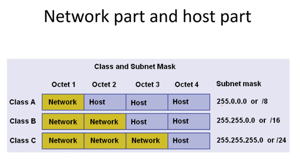

# First recording (08/06/2021)

Every machine has a unique IP address

Summary of last session (octets, classes)

Network Id
- First IP in the network
- Couldnt be allocated to any machine on the network
- All hosts should have the same network ID
- If they have different network ID, theyre on different networks
    - Usually abbreviated by: NetID
- To calculate use AND rather than class	

Subnet mask 
- is a 32-bit address used to mask a portion of the IP address to distinguish the network ID from the host ID
- Each host on a TCP/IP network requires a subnet mask
- Networks are not divided into subnets
- Two forms
    - Type one: 255.255.0.0 = 16 1s
    - Type two: IP/16 = 16 ones
Broadcast:
- Last IP in the network
- All hosts bits of the IP address will be 1s
- Cant be allocated
    - Usually abbreviated by: bcastID 

# Second recording (08/06/2021)
A switch work on the data link, doesn’t understand IP addresses, understands MAC addresses
ping is a tool that replies on a protocol called: ICMP (internet control messaging protocol)

ARP: Address resolution Protocol (gets the MAC address of the IP address)
# Third recording (08/06/2021)

Ipconfig is to find the ip of a device (windows)

Ifconfig for other OS

Ping messages:
- Reply indicates that there is a connection
- Timed out means the host did not receive a message back
- Host unreachable computer destination cannot be reached

A broadcast can never go behind a router

How to restrict the broadcast domain?
- Theyre restricted by routers (layer 3 devices)

A router is a computer that has two network cards, that can wire traffic between different networks. It is a level 3 device

A default gateway is where the traffic will be sent if the destination is not on your network

Keep the default gateway last IP value (192.168.1._) random for security
